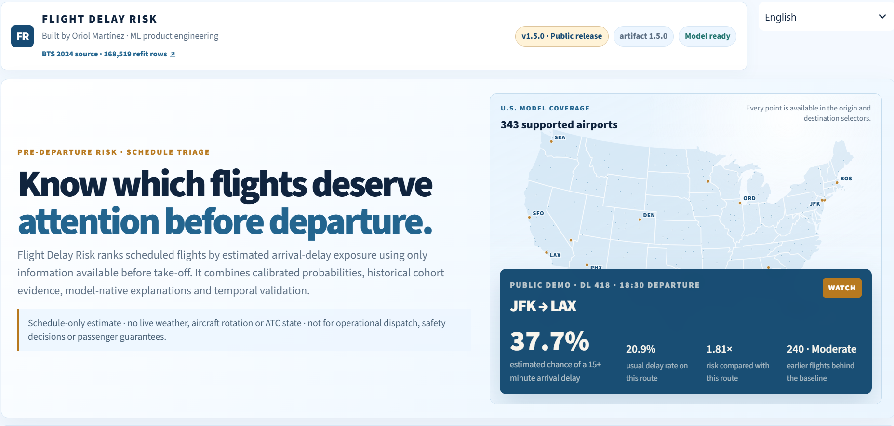
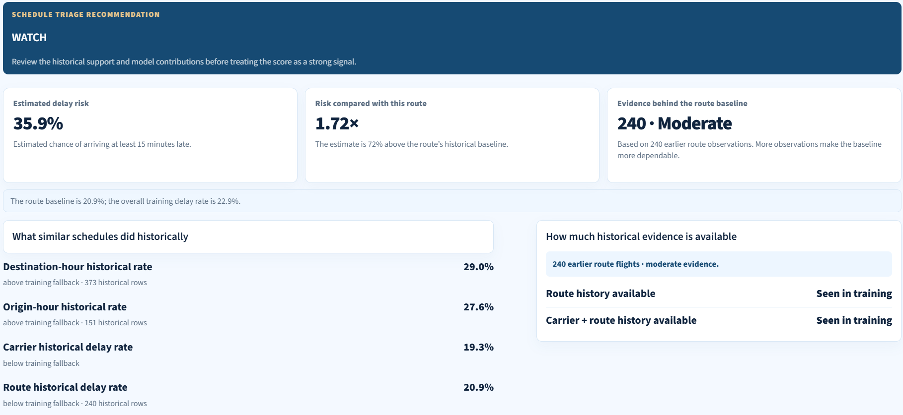
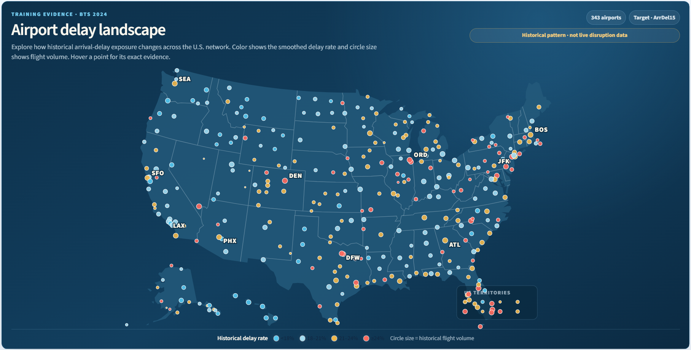
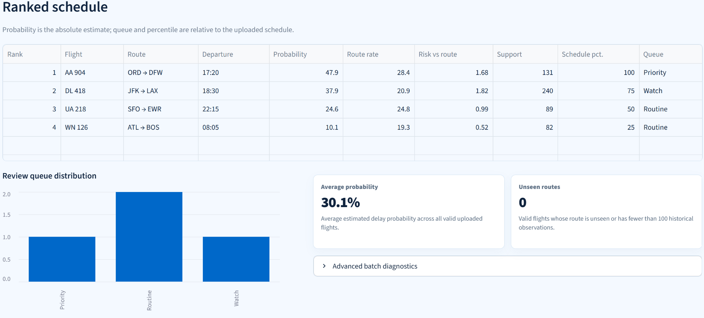
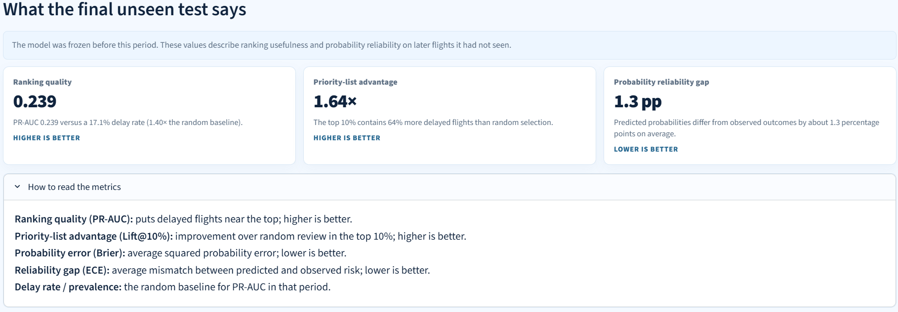
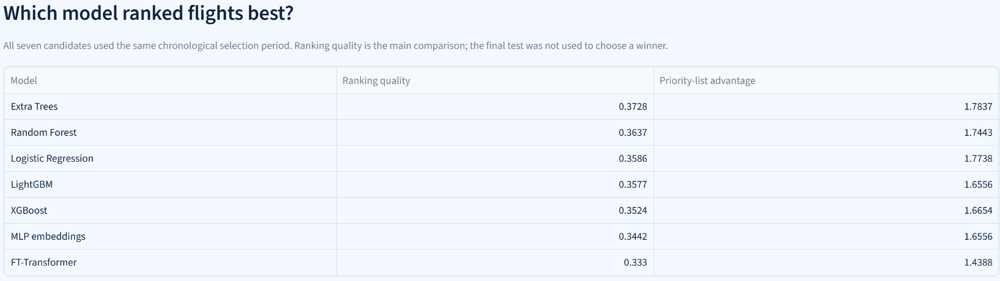

<div align="center">

[BTS source data](https://www.transtats.bts.gov/DL_SelectFields.aspx?gnoyr_VQ=FGJ) · **7,079,081 source rows** · **168,519-flight deployed refit** · **50,453-flight untouched test**

# Flight Delay Risk

### Pre-departure flight-delay risk workbench

**Pre-departure decision support for limited airline operations capacity.**

Find the scheduled flights that deserve attention first, understand why they were ranked, and inspect the evidence behind the release.

[English](README.md) · [Español](README_ES.md) · [Data guide](docs/DATA.md) · [Model card](docs/MODEL_CARD.md) · [API contract](docs/openapi.json)



`Python` · `scikit-learn` · `PyTorch` · `FastAPI` · `Streamlit` · `Docker`

</div>

## Start here

An airline operations team cannot investigate every departure with the same level of attention. Flight Delay Risk turns a published schedule into a review queue before take-off:

```text
scheduled flight → calibrated delay risk → historical evidence → review queue
```

The product answers one practical question:

> **Which scheduled flights should an analyst review first when capacity is limited?**

| Product contract | What it means |
|---|---|
| **User** | Airline operations, network-control or disruption-management analyst. |
| **Target** | Probability of arriving at least 15 minutes late (`ArrDel15`). |
| **Inputs** | Carrier, route, date, scheduled times, duration and distance. |
| **Action** | Prioritize the highest-risk 10% of an uploaded schedule. |
| **Evidence** | Route baseline, historical support, local model contributions and temporal validation. |
| **Boundary** | No live weather, aircraft rotation, crew, ATC or post-departure information. |

This is a **triage workbench**, not a promise that a flight will be delayed and not a safety or dispatch system.

## Operational result

**Honest result:** the deployed Extra Trees artifact was refitted on **168,519 flights**, calibrated with **31,028 later flights**, and evaluated once on an untouched **50,453-flight** test period from October 19 to December 31, 2024.

| Final-test signal | Result | Operational reading |
|---|---:|---|
| **Lift at top 10%** | **1.64×** | The review queue contains about 64% more delayed flights than random selection. |
| **Precision at top 10%** | **28.0%** | About 28 of every 100 prioritized flights were delayed. |
| **PR-AUC** | **0.239** | Better ranking than the **17.1%** test prevalence and the **0.203** logistic baseline. |
| **ROC-AUC** | **0.618** | Moderate discrimination from schedule-only data. |
| **Calibration error (ECE)** | **0.013** | Predicted probabilities tracked observed frequencies closely on the final test. |

The result is useful for **ranking limited attention**, not for making confident statements about individual flights. Temporal performance varies, and the committed drift audit currently reports high drift. That limitation is part of the product evidence, not hidden from it.

## Product tour

### 1. See the decision before the machinery

The landing view states the operational question, scope and current release status first. A real example shows the difference between an absolute probability, the normal rate for that route and the available historical support.

### 2. Analyze one flight

Enter natural schedule fields. Calendar and model features are derived automatically. The result returns:

- a calibrated probability of a 15+ minute arrival delay;
- `Priority`, `Watch` or `Routine` status;
- risk relative to the historical route baseline;
- the number of prior flights supporting that reference;
- factors that raised and reduced the estimate;
- a bilingual PDF brief.



### 3. Explore airport history without leaving the flow

Scroll below the single-flight form to explore the training evidence by origin or destination. Point color represents the historical delayed-flight share; point size represents support. Hovering an airport reveals its code, rate and number of historical flights.



This map describes the **historical BTS training evidence**. It is not live weather, current congestion or a forecast by itself.

### 4. Rank an entire schedule

Upload the included CSV template or a valid schedule. Valid rows are preserved even when other rows fail. The workbench flags low-support routes, ranks calibrated risk, applies the declared 10% review budget, and exports CSV and bilingual PDF reports.



### 5. Inspect validation and operations

The final two views expose chronological folds, calibration, baseline comparisons, model lineage, API endpoints, release health and deployment evidence. The technical story remains available without blocking the main decision flow.



## Product workflow

The model score and the business decision are intentionally separate:

```text
1. Estimate    How likely is a 15+ minute arrival delay?
2. Context     How unusual is that risk for this route?
3. Support     How much permitted historical evidence exists?
4. Constrain   How many flights can the team realistically review?
5. Prioritize  Which flights enter the review queue?
6. Monitor     Is calibration or feature drift deteriorating?
```

This separation lets the same calibrated model support a different capacity or cost policy without pretending that the classifier knows the operational decision.

## How the system works


```text
BTS monthly records
→ validation, cleaning and source fingerprinting
→ chronological train / selection / calibration / test blocks
→ schedule, historical, recency and congestion features
→ model-family comparison and scaled refit
→ sigmoid calibration
→ top-k review policy
→ FastAPI / Streamlit / PDF delivery
→ health checks, logging and drift monitoring
```

## Data and release lineage

The source and the deployed training sample are related, but they are not the same number.

| Layer | Rows | Role |
|---|---:|---|
| **BTS source** | **7,079,081** | Twelve monthly 2024 Reporting Carrier On-Time Performance files. |
| **Canonical cleaned dataset** | **6,965,267** | Valid supervised records covering all 366 days of 2024. |
| **Public release sample** | **250,000** | Deterministic release build using the frozen chronological protocol. |
| **Deployed refit** | **168,519** | Model training plus the selection block inherited into the final refit. |
| **Calibration** | **31,028** | Later holdout used to choose sigmoid calibration, then refit. |
| **Final test** | **50,453** | Untouched October–December evaluation window. |

The target is `ArrDel15 = 1` when arrival is at least 15 minutes late. Raw CSVs and the processed parquet are intentionally excluded from Git; the committed manifest records source hashes, row totals, schema, calendar coverage and the processed-data fingerprint.

- [Download BTS flight records](https://www.transtats.bts.gov/DL_SelectFields.aspx?gnoyr_VQ=FGJ)
- [Read the data contract](docs/DATA.md)
- [Inspect the processed-data manifest](data/processed/data_manifest.json)

## Model comparison

The model zoo compares recognizable paradigms under the same chronological selection protocol.

| Paradigm | Candidates |
|---|---|
| Interpretable baseline | Logistic Regression |
| Bagging | Random Forest, Extra Trees |
| Gradient boosting | XGBoost, LightGBM |
| Neural tabular | MLP with embeddings, FT-Transformer |

Extra Trees won the declared selection rule and was frozen before the scaled refit. Across three later temporal folds, MLP, FT-Transformer and Extra Trees each won once; no family dominated every period.



The screenshot reports the chronological **selection block** used to choose a winner. It is deliberately kept separate from the untouched final-test results reported near the top of this README.

<details>
<summary><strong>Selection benchmark</strong></summary>

| Candidate | PR-AUC | Lift@10% |
|---|---:|---:|
| **Extra Trees** | **0.3728** | **1.784×** |
| Random Forest | 0.3637 | 1.744× |
| Logistic Regression | 0.3586 | 1.774× |
| LightGBM | 0.3577 | 1.656× |
| XGBoost | 0.3524 | 1.665× |
| MLP with embeddings | 0.3442 | 1.656× |
| FT-Transformer | 0.3330 | 1.439× |

These are **selection-block** metrics, not final-test claims. The later final test is the result reported near the top of this README.

</details>

## Validation design

The release enforces forward-only evaluation:

```text
model training            2024-01-01 → 2024-07-16
selection / final refit   2024-07-17 → 2024-09-04
calibration               2024-09-05 → 2024-10-18
untouched final test      2024-10-19 → 2024-12-31
```

- Model choice is made before the final test.
- Calibration candidates are compared on a later holdout; **sigmoid** wins and is refitted on the permitted calibration block.
- The operational policy is frozen before final reporting.
- Confidence intervals use 100 weekly block-bootstrap samples.
- The release includes three temporal backtest folds, robustness checks, ablations and feature-stability evidence.

## Leakage contract

Only information available before departure may influence a prediction.

- Target-derived historical features use **strictly earlier `FlightDate` values**.
- Labels from one flight never construct another flight's features on the same day.
- Validation, calibration and test rows use maps fitted only on permitted prior periods.
- Unseen carriers, airports and routes receive explicit smoothed fallbacks.
- Actual delays, actual departure/arrival times, taxi and wheels times, cancellations, diversions and delay-cause columns are blocked.

The local explanation is a rescaled tree-path probability decomposition expressed in log-odds. It explains model behaviour, not causal mechanisms.

## Product and API surfaces

| Surface | Purpose |
|---|---|
| **Streamlit** | Bilingual single-flight analysis, schedule ranking, heatmap, validation and release evidence. |
| **FastAPI** | Typed prediction, batch ranking, reports, metadata, health and monitoring contracts. |
| **PDF / CSV** | Portable decision briefs and ranked schedules in English and Spanish. |
| **Operations** | `/live`, `/ready`, request IDs, latency headers, prediction logging and PSI monitoring. |

<details>
<summary><strong>Public endpoints</strong></summary>

```text
GET  /live
GET  /ready
GET  /model/info
GET  /model/card
POST /predict
POST /predict/batch
POST /rank
POST /reports/flight
POST /reports/schedule
GET  /monitoring/summary
GET  /monitoring/drift
```

The exported OpenAPI contract is committed at [`docs/openapi.json`](docs/openapi.json).

</details>

## Run locally

The trained artifact is included; using the product does not require retraining.

```bash
python -m venv .venv
source .venv/bin/activate      # Windows: .venv\Scripts\activate
pip install -r requirements.txt
```

Start the API:

```bash
python -m uvicorn app.api.main:app --host 0.0.0.0 --port 8000
```

Start the dashboard in another terminal:

```bash
python -m streamlit run app/dashboard/streamlit_app.py
```

Open `http://localhost:8501` for the dashboard and `http://localhost:8000/docs` for the API contract. Or run both services with:

```bash
docker compose up --build
```

## Engineering evidence

The public release ships with **108 passing tests** and committed evidence behind the artifact.

<details>
<summary><strong>Evaluation, robustness and release reports</strong></summary>

- [`reports/metrics.json`](reports/metrics.json)
- [`reports/candidate_benchmark.md`](reports/candidate_benchmark.md)
- [`reports/temporal_backtest.md`](reports/temporal_backtest.md)
- [`reports/calibration_report.md`](reports/calibration_report.md)
- [`reports/feature_ablation.md`](reports/feature_ablation.md)
- [`reports/feature_stability.md`](reports/feature_stability.md)
- [`reports/operational_policy.md`](reports/operational_policy.md)
- [`reports/robustness_audit.md`](reports/robustness_audit.md)
- [`reports/drift_analysis.md`](reports/drift_analysis.md)
- [`reports/production_smoke.json`](reports/production_smoke.json)
- [`RELEASE_MANIFEST.json`](RELEASE_MANIFEST.json)

</details>

## Repository map

```text
app/api/           FastAPI transport and public contracts
app/dashboard/     bilingual Streamlit decision interface
app/services/      prediction and reporting services
src/data/          ingestion, cleaning, manifests and temporal splitting
src/features/      schedule, historical, recency and congestion features
src/models/        training, calibration, policy and explanations
src/monitoring/    logs, robustness and drift checks
scripts/           reproducible training, evaluation and release workflows
reports/           committed evidence behind the public artifact
docs/              model card, data guide, deployment and limitations
```

## Limitations

- Schedule-only inputs cannot observe live weather, aircraft rotation, crew, ATC or active airport disruption state.
- Ranking quality varies through time; no model family dominated every temporal fold.
- Historical route evidence may be weak for rare or unseen combinations.
- The current drift audit is high, so retraining and threshold review would be required before operational reuse.
- Local contributions describe model behaviour, not why delays occur.
- The repository is deployment-ready, but no hosted URL is claimed until uptime is verified.

## What this project demonstrates

- end-to-end applied ML engineering on real public records;
- separation of prediction, evidence, policy and action;
- temporal validation and leakage prevention;
- classical, boosting and neural tabular model comparison;
- probability calibration, explanations, uncertainty and drift analysis;
- operational ranking under a capacity constraint;
- API, bilingual dashboard, PDF reporting, Docker, CI and release evidence;
- honest communication of moderate performance and model limitations.

## License

MIT. Built by **Oriol Martínez**.
