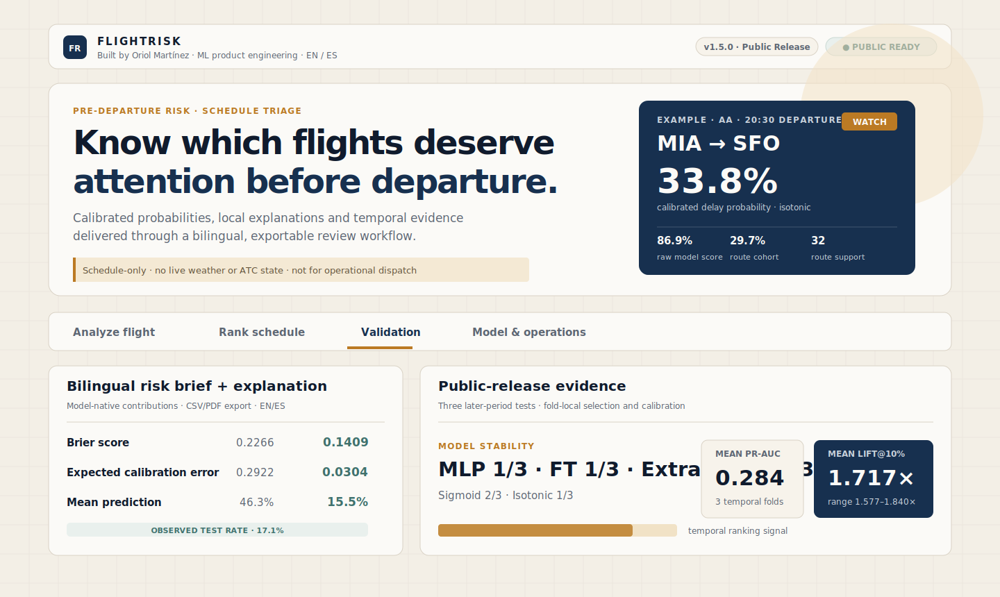
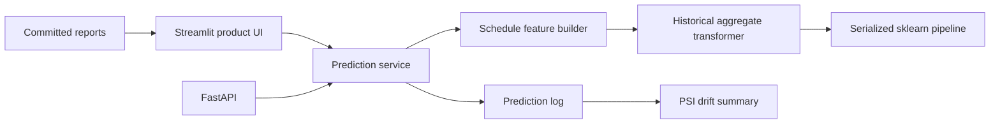

<div align="center">

# FlightRisk

### Pre-departure flight-delay risk workbench for schedule triage

Built by **Oriol Martínez**

FlightRisk ranks scheduled flights by estimated arrival-delay exposure, compares each result with its historical schedule cohort and exposes the validation evidence behind the model.

`FastAPI` · `Streamlit` · `scikit-learn` · `BTS 2024` · `temporal holdout` · `batch ranking` · `CI` · `Docker`



</div>

> **Core idea.** Most flight-delay demos return a score. FlightRisk turns that score into a review workflow: analyze one flight, rank a schedule, inspect historical context and verify where the current model is reliable—or not.

## Why FlightRisk exists

Predicting delays before departure is intrinsically noisy. The most powerful operational signals—live weather, aircraft rotation, airport congestion and ATC state—are not included in a schedule-only public-data model.

FlightRisk therefore does not pretend to be a dispatch system. It answers a narrower and more defensible question:

> Given only information available before departure, which scheduled flights deserve more attention than others?

The product is designed to demonstrate end-to-end ML engineering rather than a single notebook metric:

- reproducible data preparation and model training;
- explicit leakage controls;
- temporal train/validation/test separation;
- candidate-model comparison;
- ranking metrics for schedule triage;
- FastAPI and Streamlit delivery surfaces;
- prediction logging and drift monitoring;
- Docker and continuous integration.

---

## Product tour

FlightRisk v0.8.0 is organised around four real product surfaces.

### 1. Analyze flight

Enter natural schedule fields:

- carrier, origin and destination;
- flight date;
- scheduled departure and arrival time;
- scheduled duration and distance.

The UI derives month, weekday and HHMM model inputs automatically. The result combines:

- current model probability;
- historical route cohort rate;
- relative exposure against the route cohort;
- estimated historical support;
- route and carrier-route coverage;
- non-causal schedule context signals.

The interface labels the current probability honestly: the committed artifact is **not yet post-calibrated**, so it should be interpreted mainly as a ranking signal.

### 2. Rank schedule

Upload a CSV or load the bundled sample schedule. FlightRisk:

1. validates the required schema;
2. scores the batch in one vectorised model call;
3. sorts flights from highest to lowest model probability;
4. assigns `Priority`, `Watch` and `Routine` review queues;
5. exports the ranked schedule as CSV.

This workflow reflects the strongest current use case of the model: **relative prioritisation**, not exact operational forecasting.

### 3. Validation

The UI surfaces committed evaluation evidence instead of hiding it in documentation:

- held-out PR-AUC;
- Precision@Top10%;
- Lift@Top10%;
- model comparison;
- calibration diagnostic;
- validation-candidate comparison;
- explicit next experimental gates.

### 4. Model & operations

The final surface exposes:

- model card and artifact lineage;
- training-row and feature counts;
- the pre-departure leakage contract;
- API endpoints;
- repository architecture;
- intended and prohibited uses.

---

## Current artifact and honest result

The committed artifact was trained from official U.S. BTS Reporting Carrier On-Time Performance data covering 2024.

| Split | Rows |
|---|---:|
| Model training | 1,511,025 |
| Validation | 377,757 |
| Held-out test | 472,196 |

The validation-selected model is a Random Forest. On the final held-out period:

| Metric | Random Forest |
|---|---:|
| ROC-AUC | 0.602 |
| PR-AUC | 0.213 |
| F1 | 0.301 |
| Precision@Top10% | 0.242 |
| Lift@Top10% | 1.512× |

### Honest result: the baseline generalized better

The Logistic Regression baseline slightly outperformed the selected Random Forest on the final test period:

| Model | ROC-AUC | PR-AUC | F1 | Precision@Top10% | Lift@Top10% |
|---|---:|---:|---:|---:|---:|
| Logistic Regression | **0.611** | **0.219** | **0.306** | **0.253** | **1.578×** |
| Random Forest | 0.602 | 0.213 | 0.301 | 0.242 | 1.512× |

This result is not hidden or reframed as a win. It indicates that the original single validation split did not produce a fully stable model-selection decision. The next model iteration will use expanding temporal backtesting, ordered historical encoding and post-hoc calibration before freezing a new artifact.

All committed values come from `reports/metrics.json`.

---

## What the model predicts

**Target:** `ArrDel15`

```text
ArrDel15 = 1  → arrival delay is 15 minutes or more
ArrDel15 = 0  → arrival delay is below 15 minutes
```

The classifier returns:

```text
P(ArrDel15 = 1 | pre-departure schedule information)
```

The current UI describes this as a **model probability**, but also exposes the calibration limitation. It is not a passenger guarantee or an operational dispatch probability.

---

## Leakage contract

The project treats feature availability as a first-class engineering constraint.

### Allowed before departure

- reporting carrier;
- origin and destination airport;
- calendar fields;
- scheduled departure and arrival times;
- scheduled duration and distance;
- historical aggregates fitted from training data.

### Explicitly blocked

```text
ArrDelay, ArrDelayMinutes, DepDelay,
ActualElapsedTime, AirTime,
TaxiOut, TaxiIn,
WheelsOff, WheelsOn,
DepTime, ArrTime,
CarrierDelay, WeatherDelay, NASDelay, LateAircraftDelay,
Cancelled, Diverted
```

`Cancelled` and `Diverted` may be used as cleaning filters, but never as inference features.

### Temporal split boundary

From v0.8.0, the core time-aware split cuts on complete `FlightDate` values. The same date can no longer appear in both training and test partitions.

```python
assert train.FlightDate.max() < test.FlightDate.min()
```

---

## Features

### Raw schedule inputs

| Input | Meaning |
|---|---|
| `Airline` | Reporting carrier code |
| `Origin` | Origin airport IATA code |
| `Dest` | Destination airport IATA code |
| `Month` | Scheduled month |
| `DayOfWeek` | ISO weekday, 1–7 |
| `CRSDepTime` | Scheduled departure in HHMM format |
| `CRSArrTime` | Scheduled arrival in HHMM format |
| `CRSElapsedTime` | Scheduled duration in minutes |
| `Distance` | Route distance in miles |

### Derived schedule features

- departure and arrival hour;
- cyclical hour encoding;
- morning/evening peak flags;
- red-eye and weekend flags;
- route and carrier-route keys;
- distance band and long-haul flag;
- scheduled speed and log distance.

### Historical aggregate features

- carrier delay rate;
- route delay rate;
- origin and destination rates;
- carrier-route rate;
- carrier-origin and carrier-destination rates;
- origin-hour and destination-hour rates;
- frequency/share features for the same cohorts.

The current aggregate encoder is fitted on the training partition and uses fallbacks for unseen groups. A stricter ordered temporal encoding is deliberately listed as the next major model iteration.

---

## Model candidates

| Candidate | Role |
|---|---|
| Logistic Regression | Fast, interpretable sparse baseline |
| L1 Logistic Regression | Sparse linear candidate; v0.8.0 fixes the explicit `penalty="l1"` configuration |
| Random Forest | Non-linear validation-selected artifact |
| Extra Trees | More randomised tree ensemble |
| Gradient Boosting | Optional slower experiment |

The project does not assume that the most complex model should win. The committed test evidence currently favours the linear baseline.

---

## System architecture



| Layer | Path | Responsibility |
|---|---|---|
| Product UI | `app/dashboard/` | Analyze, rank, validate and inspect operations |
| API | `app/api/` | Typed HTTP transport and OpenAPI documentation |
| Service | `app/services/` | Artifact loading, inference and historical context |
| Data | `src/data/` | Loading, normalization, cleaning and temporal splitting |
| Features | `src/features/` | Schedule features and train-fitted aggregates |
| Models | `src/models/` | Training, evaluation, inference and registry |
| Monitoring | `src/monitoring/` | Prediction logging and PSI checks |
| Workflows | `scripts/` | Training, evaluation, backtesting and quality gate |
| Evidence | `reports/` | Metrics, calibration bins and error analysis |

---

## API surface

Run the API and open `/docs` for interactive OpenAPI documentation.

```text
GET  /health
GET  /model/info
GET  /model/card
POST /predict
POST /predict/batch
POST /rank
GET  /monitoring/summary
GET  /monitoring/drift
```

Example request:

```json
{
  "airline": "DL",
  "origin": "JFK",
  "destination": "LAX",
  "month": 7,
  "day_of_week": 5,
  "crs_dep_time": 1830,
  "crs_arr_time": 2145,
  "crs_elapsed_time": 375,
  "distance": 2475
}
```

---

## Run locally

### 1. Create an environment

```bash
python -m venv .venv
```

Activate it and install dependencies:

```bash
pip install -r requirements.txt
```

### 2. Start the dashboard

```bash
streamlit run app/dashboard/streamlit_app.py
```

### 3. Start the API

```bash
uvicorn app.api.main:app --reload
```

### Docker Compose

```bash
docker compose up --build
```

---

## Quality gate

```bash
python -m scripts.quality_gate
```

The gate checks:

- Python compilation;
- Ruff linting when installed;
- full pytest suite;
- artifact load;
- single-flight inference;
- vectorised batch inference;
- report availability.

The GitHub Actions workflow also runs the test suite, a training smoke test and an API Docker build.

---

## Known limitations

- The current artifact uses schedule information only.
- It has no live weather, ATC, aircraft-rotation or airport-state feed.
- The committed probability output is not post-calibrated.
- Current historical aggregates are train-fitted but not yet ordered/out-of-fold for training rows.
- A single validation split selected the Random Forest, while the linear baseline generalized better on test.
- The European context layer is experimental and is not a Europe-calibrated flight-level model.
- The system is not intended for dispatch, safety, legal or compensation decisions.

These limitations are part of the product and model card, not buried in fine print.

---

## v0.8.0 — Product Foundation

This release establishes the product and repository standard that future iterations build on:

- new warm operational visual identity;
- personal byline and single public release version;
- four real dashboard surfaces;
- natural date/time inputs;
- historical cohort and support context;
- schedule-ranking review queue;
- validation evidence in the UI;
- complete-date temporal split boundary;
- real L1 configuration;
- vectorised batch inference;
- recruiter-first README;
- stale visual assets and brittle UI tests removed.

### Next major iteration

The next model release will focus on:

1. ordered temporal historical encoding;
2. expanding-window model selection;
3. sigmoid/isotonic calibration comparison;
4. Brier score and Expected Calibration Error;
5. stable percentile-based priority tiers;
6. a newly trained and frozen artifact.

---

## Repository structure

```text
app/
  api/                 FastAPI application
  dashboard/           Streamlit product UI and visual system
  services/            Inference and context service
src/
  data/                Loading, cleaning and temporal splitting
  features/            Schedule and historical features
  models/              Training, evaluation, inference and artifact registry
  monitoring/          Logging and drift monitoring
scripts/                Reproducible command-line workflows
tests/                  Unit, integration and product-contract tests
reports/                Committed evaluation evidence
models/                 Serialized model artifact
docs/                   Architecture, model card and deployment notes
```

---

## Intended portfolio signal

FlightRisk is designed to demonstrate that the author can:

- reason about leakage and temporal validation;
- choose metrics for an imbalanced ranking problem;
- report disappointing or unstable results honestly;
- package a complete scikit-learn pipeline;
- expose the model through an API and a product UI;
- add monitoring, tests, Docker and CI;
- communicate model limitations without weakening the product story.

**FlightRisk is a portfolio ML system, not an operational aviation product.**
