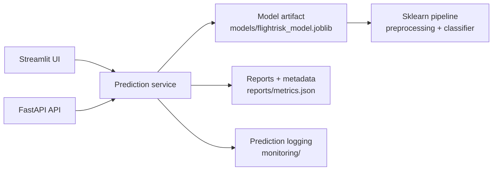
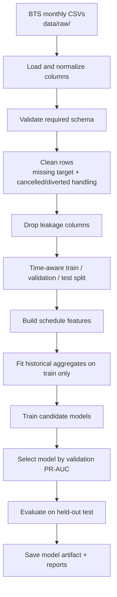

# FlightRisk — Flight Delay Probability Model

FlightRisk estimates the probability that a scheduled flight will arrive **15+ minutes late** using only information available **before departure**.

```text
scheduled flight → P(ArrDel15 = 1) → risk level → explanation / ranking
```

The project is designed as a portfolio-grade ML engineering system: reproducible training, leakage-aware feature engineering, candidate model comparison, evaluation reports, a Streamlit UI, and a FastAPI service.

---

## What the model predicts

**Target:** `ArrDel15`

`ArrDel15 = 1` means that the flight arrived **15 minutes or more late**.  
`ArrDel15 = 0` means that the flight did not arrive 15+ minutes late.

The output of the model is therefore:

```text
P(ArrDel15 = 1)
```

Example:

```text
DL · JFK → LAX · scheduled departure 18:30
Delay probability: 47.1%
Risk level: Moderate
```

---

## Why this project exists

Predicting flight delays before departure is hard because the most predictive signals are often unavailable in advance: live weather, ATC state, aircraft rotation, crew constraints, airport congestion and cascading network disruptions.

FlightRisk intentionally limits itself to **pre-flight schedule information** and **historical patterns**. The goal is not to claim perfect delay prediction; the goal is to build a realistic, honest, end-to-end ML system that answers:

> Given what we know before the flight departs, how much delay risk can we estimate?

---

## Current artifact and results

The committed model artifact is trained from a 12-month BTS 2024 run with a sampled training configuration. The raw BTS CSVs are intentionally **not committed**.

| Split | Rows |
|---|---:|
| Model training | 1,511,025 |
| Validation | 377,757 |
| Held-out test | 472,196 |

### Selected model: Random Forest

Random Forest was selected because it achieved the best **validation PR-AUC** among the default candidate models.

| Metric | Held-out test |
|---|---:|
| ROC-AUC | 0.602 |
| PR-AUC | 0.213 |
| F1 | 0.301 |
| Precision | 0.211 |
| Recall | 0.525 |
| Precision@Top10% | 0.242 |
| Lift@Top10% | 1.512 |
| Decision threshold | 0.520 |

### Important baseline note

The Logistic Regression baseline slightly outperformed the selected Random Forest on the final held-out test split:

| Model | ROC-AUC | PR-AUC | F1 | Precision@Top10% | Lift@Top10% |
|---|---:|---:|---:|---:|---:|
| Logistic Regression baseline | 0.611 | 0.219 | 0.306 | 0.253 | 1.578 |
| Selected Random Forest | 0.602 | 0.213 | 0.301 | 0.242 | 1.512 |

This is reported transparently in `reports/metrics.json`. It suggests that model selection is somewhat unstable and that future work should use stronger temporal cross-validation, calibration checks and additional real-time features.

This is not a failure of the project; it is an honest result from a difficult, noisy prediction problem.

---

## Why these metrics?

Flight delay prediction is an imbalanced and noisy binary classification problem. A single accuracy score would be misleading because most flights are not 15+ minutes late.

| Metric | Why it is used |
|---|---|
| **ROC-AUC** | Measures ranking quality across all thresholds. Useful as a general separability metric. |
| **PR-AUC** | More informative than ROC-AUC when the positive class is relatively rare. Used for model selection. |
| **F1** | Balances precision and recall at the chosen decision threshold. Useful but not the only objective. |
| **Precision / Recall** | Shows the tradeoff between false alarms and missed delayed flights. |
| **Precision@TopK** | Measures how many flights in the highest-risk bucket actually become delayed. Useful for operational prioritization. |
| **Lift@TopK** | Measures whether the top-risk group contains more delayed flights than random selection. This is useful when the model is used to rank flights by risk. |
| **Calibration bins** | Compare predicted probability against observed delay frequency. Important because the UI displays probabilities, not just class labels. |

**Why PR-AUC for model selection?**  
Because the project predicts a minority event: arrival delay of 15+ minutes. PR-AUC focuses more directly on performance for the positive class than plain accuracy or ROC-AUC.

**Why keep Lift@TopK?**  
Because even if individual prediction is noisy, a useful model can still help prioritize the flights most likely to be delayed.

---

## System architecture



### Main components

| Layer | Path | Purpose |
|---|---|---|
| UI | `app/dashboard/streamlit_app.py` | Single-flight prediction, probability visualization, batch mode and expandable technical documentation. |
| API | `app/api/main.py` | FastAPI endpoints for prediction, batch prediction, ranking, model info and monitoring. |
| Service layer | `app/services/prediction_service.py` | Loads the model artifact and exposes prediction/ranking functions. |
| Data pipeline | `src/data/` | Loads, normalizes, validates, cleans and splits BTS data. |
| Feature engineering | `src/features/` | Builds schedule features and train-fitted historical aggregate rates. |
| Modeling | `src/models/` | Candidate models, training, evaluation, thresholding, uncertainty and registry. |
| Reports | `reports/` | Metrics, confusion matrix, classification report, feature importance and error analysis. |
| Training scripts | `scripts/` | Reproducible CLI commands for training, evaluation and temporal backtesting. |

---

## Training pipeline



### Cleaning and leakage controls

The project is explicitly designed to avoid using information that would not be available before departure.

| Step | What happens | Why it matters |
|---|---|---|
| Required schema validation | Ensures that core BTS columns are present. | Prevents silent training on malformed data. |
| Drop missing target rows | Removes rows without `ArrDel15`. | The target is required for supervised training and evaluation. |
| Filter cancelled/diverted flights | Uses `Cancelled` and `Diverted` only as cleaning filters. | Those rows do not have a normal arrival-delay outcome. |
| Drop forbidden leakage columns | Removes actual delay, taxi, wheels, actual elapsed time and cancellation fields. | Prevents post-flight information from leaking into the model. |
| Type coercion | Converts times, distances and calendar fields to numeric values. | Makes downstream feature engineering robust. |
| Time-aware split when `FlightDate` is available | Earlier flights train, later flights test. | Better matches the real deployment scenario than a random split. |

Forbidden leakage examples:

```text
ArrDelay, ArrDelayMinutes, DepDelay, ActualElapsedTime, AirTime,
TaxiOut, TaxiIn, WheelsOff, WheelsOn, DepTime, ArrTime,
CarrierDelay, WeatherDelay, NASDelay, LateAircraftDelay,
Cancelled, Diverted
```

---

## Variables used by the model

The model uses only schedule-time inputs plus historical aggregates fitted from the training split.

### Raw pre-flight inputs

| Variable | Meaning |
|---|---|
| `Airline` | Reporting carrier code. |
| `Origin` | Origin airport code. |
| `Dest` | Destination airport code. |
| `Month` | Scheduled month. |
| `DayOfWeek` | Scheduled day of week. |
| `CRSDepTime` | Scheduled departure time in HHMM format. |
| `CRSArrTime` | Scheduled arrival time in HHMM format. |
| `CRSElapsedTime` | Scheduled duration in minutes. |
| `Distance` | Scheduled route distance. |

### Derived schedule features

| Feature group | Examples | Why it is useful |
|---|---|---|
| Time of day | `DepHour`, `ArrHour`, `DepPeriod`, `ArrPeriod` | Delay risk varies across morning, afternoon, evening peak and red-eye periods. |
| Calendar | `Month`, `DayOfWeek`, `IsWeekend` | Captures weekly and seasonal patterns. |
| Route | `Route`, `CarrierRoute` | Some routes and carrier-route combinations are structurally more delay-prone. |
| Distance profile | `DistanceBand`, `IsLongHaul`, `ScheduledSpeedMph`, `LogDistance` | Flight length and scheduled speed can proxy different operational profiles. |
| Cyclical time encoding | `DepHourSin`, `DepHourCos`, `ArrHourSin`, `ArrHourCos` | Represents hour-of-day without artificial discontinuity between 23:00 and 00:00. |
| Peak indicators | `IsMorningPeak`, `IsEveningPeak`, `IsPeakHour`, `IsRedEye` | Airports and schedules behave differently during high-pressure time windows. |

### Historical aggregate features

Historical rates are fitted on the training data only, then applied to validation/test/inference rows.

| Aggregate | Meaning |
|---|---|
| `CarrierDelayRate` | Historical delay rate for the carrier. |
| `RouteDelayRate` | Historical delay rate for the origin-destination route. |
| `OriginDelayRate` | Historical delay rate from the origin airport. |
| `DestDelayRate` | Historical delay rate into the destination airport. |
| `CarrierRouteDelayRate` | Historical delay rate for the carrier-route combination. |
| `AirlineOriginDelayRate` | Historical carrier-origin risk. |
| `AirlineDestDelayRate` | Historical carrier-destination risk. |
| `OriginHourDelayRate` | Historical risk for origin airport at scheduled departure hour. |
| `DestHourDelayRate` | Historical risk for destination airport at scheduled arrival hour. |
| `CarrierDepHourDelayRate` | Historical carrier risk by scheduled departure hour. |
| `RouteFlightShare`, `CarrierRouteFlightShare`, etc. | Frequency / volume proxies for schedule density. |

---

## Why these models?

The project trains multiple candidate models so the selected artifact is not based on a single arbitrary choice.

| Model | Why included | Tradeoff |
|---|---|---|
| Logistic Regression | Fast, interpretable, strong baseline for sparse one-hot encoded tabular data. | Linear; may miss nonlinear interactions. |
| L1 Logistic Regression | Encourages sparsity and can select a smaller set of route/carrier signals. | Still linear and sensitive to regularization. |
| Random Forest | Handles nonlinear interactions and exposes feature importances. Selected by validation PR-AUC in the current run. | Can overfit validation and may be less stable out-of-sample. |
| Extra Trees | Similar tree ensemble, often faster and more randomized than Random Forest. | Can be noisy and less calibrated. |
| Gradient Boosting | Available as an optional slower experiment. | Dense one-hot representation can be expensive on large BTS data. |

The current report shows why the baseline remains important: the Random Forest won validation PR-AUC, but Logistic Regression generalized slightly better on the held-out test set.

---

## How to run the app

```powershell
python -m venv .venv
.venv\Scripts\activate
pip install -r requirements.txt
streamlit run app/dashboard/streamlit_app.py
```

English is the default UI language. A visible selector allows switching to Spanish.

---

## How to run the API

```powershell
uvicorn app.api.main:app --reload
```

Useful endpoints:

| Endpoint | Purpose |
|---|---|
| `GET /health` | Service health check. |
| `GET /model/info` | Basic model metadata. |
| `GET /model/card` | Model card response. |
| `POST /predict` | Single-flight delay probability. |
| `POST /predict/batch` | Batch probability scoring. |
| `POST /rank` | Batch scoring sorted by predicted delay probability. |
| `GET /monitoring/summary` | Runtime prediction logging summary. |
| `GET /monitoring/drift` | Simple drift reference report. |

---

## Data setup for retraining

Raw BTS data is not committed to the repository.

Place monthly BTS CSVs here:

```text
data/raw/bts_2024_01.csv
data/raw/bts_2024_02.csv
...
data/raw/bts_2024_12.csv
```

Minimum required BTS columns:

```text
Year, Month, DayOfWeek, Reporting_Airline, Origin, Dest,
CRSDepTime, CRSArrTime, CRSElapsedTime, Distance,
ArrDel15, Cancelled, Diverted
```

`Cancelled` and `Diverted` are used only as cleaning filters. They are not model features.

---

## How to retrain

Fast smoke run:

```powershell
python -m scripts.run_real_data_demo --selection-metric pr_auc --bootstrap-samples 0 --max-rows-per-month 5000
```

Larger sampled run:

```powershell
python -m scripts.run_real_data_demo --selection-metric pr_auc --bootstrap-samples 0 --max-rows-per-month 200000
```

Full local run using all CSV rows available in `data/raw/`:

```powershell
python -m scripts.run_real_data_demo --selection-metric pr_auc --bootstrap-samples 0
```

Optional slower experiment with Gradient Boosting:

```powershell
python -m scripts.run_real_data_demo --selection-metric pr_auc --bootstrap-samples 0 --max-rows-per-month 200000 --include-gradient-boosting
```

Temporal backtest:

```powershell
python -m scripts.run_temporal_backtest --n-splits 6 --bootstrap-samples 50 --output reports\temporal_backtest_2024_full.json
```

---

## Repository policy

The repository should include:

```text
source code
README / docs / tests
reports/*.json / *.csv / *.txt / *.md
models/flightrisk_model.joblib
small sample data
```

The repository should not include:

```text
data/raw/*.csv
data/processed/*.parquet
large local training artifacts
monitoring logs
__pycache__ / .pytest_cache
```

The committed model is small enough to version normally. Git LFS is not required for the current artifact.

---

## Limitations

- The model does not use live weather, ATC state, aircraft rotation, crew state, gate availability or real-time airport congestion.
- The current selected model is not clearly superior to the Logistic Regression baseline on the held-out test split.
- Reported probabilities should be interpreted as estimated risk, not guarantees.
- The project is a portfolio ML engineering project, not a safety-critical aviation system.
- It should not be used for dispatch-critical, legal, compensation or operational aviation decisions.

---

## Project map

```text
app/dashboard/            Streamlit UI
app/api/                  FastAPI API
app/services/             Prediction service layer
src/data/                 Loading, validation, cleaning and splitting
src/features/             Schedule features and historical aggregates
src/models/               Training, evaluation, thresholding and registry
scripts/                  Reproducible training/backtest commands
reports/                  Metrics and evaluation artifacts
models/                   Committed demo model artifact
tests/                    Unit and smoke tests
```
