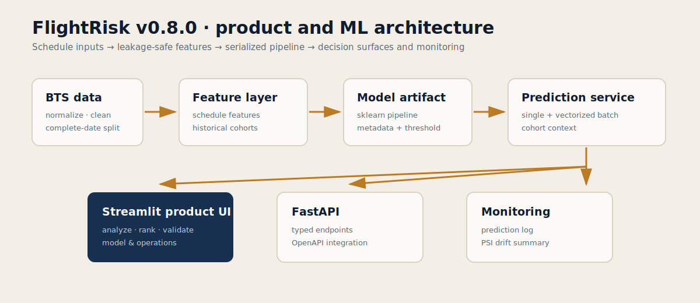

<div align="center">

# FlightRisk

### Pre-departure flight-delay risk workbench · English / Español

Built by **Oriol Martínez**

FlightRisk ranks scheduled flights by estimated arrival-delay exposure, validates every uploaded row, explains the selected linear model, and exposes the temporal evidence behind the public artifact.

`English / Español` · `FastAPI` · `Streamlit` · `scikit-learn` · `BTS 2024` · `temporal validation` · `calibration` · `PDF reports` · `monitoring` · `Docker`


**[English](README.md) · [Español](README_ES.md)**

</div>

> **Core idea.** Most flight-delay demos return a score. FlightRisk turns that score into a review workflow: enter or upload a schedule, rank risk, inspect evidence, verify temporal stability and export a bilingual brief.

## Public release status

FlightRisk v1.0.0 is the stable portfolio release. The archive includes the trained artifact, committed validation evidence, bilingual UI, PDF exports, API, monitoring and deployment configuration.

A hosted URL is intentionally not hard-coded in this archive. After deployment, add the public dashboard and API links here and in `docs/PUBLIC_RELEASE.md`.

## Product tour

### 1. Analyze flight

Enter natural schedule fields:

- carrier and optional flight number;
- origin and destination;
- flight date;
- scheduled departure and arrival;
- scheduled duration and distance.

The application derives all model features and returns:

- calibrated probability of a 15+ minute arrival delay;
- raw model score for traceability;
- historical route rate and exact support;
- relative exposure against the route cohort;
- route and carrier-route coverage;
- signed local model contributions;
- bilingual PDF risk brief.

The local explanation is native to the selected L1 Logistic Regression pipeline. Contributions are measured in log-odds before calibration. They explain model behaviour, not real-world causes.

### 2. Rank schedule

Upload the natural CSV template or load the bundled sample:

```csv
flight_number,airline,origin,destination,flight_date,scheduled_departure,scheduled_arrival,scheduled_duration_minutes,distance_miles
418,DL,JFK,LAX,2026-07-18,18:30,21:45,375,2475
```

FlightRisk then:

1. normalizes supported column aliases;
2. validates schema and values row by row;
3. excludes malformed rows without discarding the valid schedule;
4. reports unseen and low-support routes before ranking;
5. transforms the valid batch once;
6. produces calibrated probabilities and historical context;
7. ranks flights into `Priority`, `Watch` and `Routine` queues;
8. exports CSV and bilingual PDF briefs.

Priority tiers are relative to the uploaded schedule. Calibrated probability remains the model's absolute estimate.

### 3. Validation

The validation surface reads committed reports and exposes:

- held-out PR-AUC and Lift@10%;
- Brier score and expected calibration error;
- reliability curve on the untouched test period;
- four expanding temporal folds;
- fold-level model and calibration selection;
- development benchmark across four model families;
- the ordered historical-encoding contract.

### 4. Model & operations

The operations surface exposes:

- artifact and feature lineage;
- training, validation and test periods;
- live demo prediction counts;
- average logged probability;
- PSI drift status;
- measured local inference latency;
- model card, leakage contract and API surface;
- Docker and public-deployment instructions.

---

## Honest result

### Held-out test

| Metric | v1.0.0 artifact |
|---|---:|
| ROC-AUC | 0.6023 |
| PR-AUC | 0.2124 |
| Precision@Top10% | 0.2505 |
| Lift@Top10% | 1.557× |
| Brier score | 0.1336 |
| Expected calibration error | 0.0229 |

The discrimination is useful but modest. FlightRisk is not presented as a solved delay-prediction system. Its value is the combination of temporal rigor, calibrated probabilities, auditable cohort context and production-shaped delivery.

### Calibration impact

| Metric | Raw score | Calibrated probability |
|---|---:|---:|
| Brier score | 0.3036 | **0.1336** |
| Expected calibration error | 0.3947 | **0.0229** |
| Log loss | 0.8178 | **0.4378** |
| Mean prediction | 0.5556 | **0.1786** |
| Observed positive rate | 0.1609 | 0.1609 |

Calibration is selected and fitted only on the validation period. Test outcomes never participate in calibration.

### Temporal stability

Across four expanding temporal folds:

| Metric | Mean | Std | Range |
|---|---:|---:|---:|
| ROC-AUC | 0.6317 | 0.0307 | 0.5912-0.6655 |
| PR-AUC | 0.2659 | 0.0811 | 0.1975-0.3798 |
| Precision@Top10% | 0.3116 | 0.0970 | 0.2377-0.4471 |
| Lift@Top10% | 1.6569× | 0.1719 | 1.4010-1.7645× |
| Brier score | 0.1498 | 0.0234 | 0.1221-0.1785 |
| ECE | 0.0550 | 0.0350 | 0.0128-0.0842 |

```text
L1 Logistic Regression selected: 4 / 4 folds
Isotonic calibration selected:    4 / 4 folds
```

Extra Trees won one isolated validation block by a small margin. L1 Logistic is deployed because it was selected in all four temporal folds, is inspectable, and provides the more stable release decision. The disagreement is documented rather than hidden.

See:

- [`reports/temporal_backtest.md`](reports/temporal_backtest.md)
- [`reports/calibration_report.md`](reports/calibration_report.md)
- [`reports/candidate_benchmark.md`](reports/candidate_benchmark.md)

---

## Current artifact

The source parquet contains **2,360,978** cleaned BTS 2024 flight records. The public artifact was trained from a deterministic **300,000-row chronological sample** spanning the complete available date range.

| Partition | Date range | Rows |
|---|---|---:|
| Model training | 2024-01-01 - 2024-08-06 | 189,897 |
| Calibration / validation | 2024-08-07 - 2024-10-06 | 49,622 |
| Held-out test | 2024-10-07 - 2024-12-11 | 60,481 |

The artifact contains:

- L1 Logistic Regression pipeline;
- ordered and smoothed historical aggregate maps;
- exact cohort-support maps;
- isotonic calibrator;
- validation-selected decision threshold;
- model metadata and evaluation evidence.

### Target

```text
ArrDel15 = 1  -> arrival delay is 15 minutes or more
ArrDel15 = 0  -> arrival delay is below 15 minutes
```

The displayed probability is:

```text
calibrated P(ArrDel15 = 1 | pre-departure schedule information)
```

It is not a live flight status, passenger guarantee or dispatch probability.

---

## Leakage contract

### Allowed before departure

- reporting carrier;
- origin and destination;
- calendar and scheduled times;
- scheduled duration and distance;
- historical rates and frequency maps built from prior dates.

### Explicitly blocked

```text
ArrDelay, ArrDelayMinutes, DepDelay,
ActualElapsedTime, AirTime,
TaxiOut, TaxiIn,
WheelsOff, WheelsOn,
DepTime, ArrTime,
CarrierDelay, WeatherDelay, NASDelay, LateAircraftDelay,
Cancelled, Diverted
```

Training-row historical features use targets from strictly earlier `FlightDate` values. Rows from the same date are transformed together, preventing same-day target leakage.

```python
assert train.FlightDate.max() < validation.FlightDate.min()
assert validation.FlightDate.max() < test.FlightDate.min()
```

---

## Architecture



```text
BTS data
  -> normalization and leakage removal
  -> complete-date temporal split
  -> strictly prior-date historical encoding
  -> candidate model comparison
  -> validation-only calibration
  -> versioned artifact
  -> inference + model-native explanations
  -> bilingual Streamlit / FastAPI / PDF delivery
  -> prediction logging + PSI monitoring
```

Repository map:

```text
app/api/           FastAPI transport and report endpoints
app/dashboard/     bilingual Streamlit product surface
app/services/      prediction, cohort-context and PDF services
src/data/          loading, cleaning and temporal splitting
src/features/      schedule features and historical aggregates
src/models/        training, calibration, explanation and inference
src/monitoring/    prediction logs and PSI drift checks
scripts/           training, backtest, quality and benchmark workflows
reports/           committed model and performance evidence
```

---

## API

```text
GET  /health
GET  /model/info
GET  /model/card
POST /predict
POST /predict/batch
POST /rank
POST /reports/flight
POST /reports/schedule
GET  /monitoring/summary
GET  /monitoring/drift
```

Interactive OpenAPI documentation is available at `/docs` when the API is running.

Example prediction response:

```json
{
  "delay_probability": 0.1691,
  "raw_model_score": 0.5874,
  "calibration_method": "isotonic",
  "risk_level": "moderate",
  "local_contributions": [
    {
      "feature": "RouteDelayRate",
      "contribution": 0.184,
      "direction": "increase"
    }
  ],
  "explanation_scale": "log_odds_before_calibration"
}
```

---

## Measured performance

Committed local release measurements after warm-up:

| Operation | Median |
|---|---:|
| Artifact load | 1,894.2 ms |
| Single prediction | 49.9 ms |
| 100-flight batch | 177.2 ms |
| 1,000-flight batch | 1,344.5 ms |

These figures were measured in the release environment. Hosted latency also depends on network overhead and cold starts. Full environment metadata is in [`reports/performance_benchmark.json`](reports/performance_benchmark.json).

---

## Run locally

### Python

```bash
python -m venv .venv
source .venv/bin/activate      # Windows: .venv\Scripts\activate
pip install -r requirements.txt

streamlit run app/dashboard/streamlit_app.py
uvicorn app.api.main:app --reload
```

### Docker

```bash
docker compose up --build
```

- Dashboard: `http://localhost:8501`
- API: `http://localhost:8000`
- OpenAPI: `http://localhost:8000/docs`

### Make targets

```bash
make setup
make test
make quality
make benchmark
make dashboard
make api
```

---

## Reproduce the model evidence

```bash
python -m scripts.prepare_data
python -m scripts.train_model --max-rows 300000 --candidate-profile linear
python -m scripts.run_temporal_backtest --max-rows 300000 --candidate-profile linear
python -m scripts.evaluate_model
python -m scripts.benchmark_inference
python -m scripts.quality_gate
```

Raw BTS data is not included in the public archive. Download and preparation commands are documented in [`docs/DATA.md`](docs/DATA.md).

---

## Quality gate

```bash
python -m scripts.quality_gate
```

The v1.0.0 gate verifies:

- compilation and Ruff;
- complete test suite;
- artifact version and loadability;
- calibrated single and vectorized batch inference;
- model-native explanation output;
- bilingual PDF generation;
- committed temporal, calibration and performance reports;
- release manifest integrity.

---

## Deployment

The repository contains:

- `Dockerfile.api`;
- `Dockerfile.dashboard`;
- `docker-compose.yml`;
- `render.yaml`;
- Streamlit configuration;
- health endpoint and release checks.

Deployment steps and the places where public URLs should be inserted are documented in [`docs/PUBLIC_RELEASE.md`](docs/PUBLIC_RELEASE.md).

---

## Limitations

- No live weather, aircraft rotation, crew, ATC or airport-operations state.
- BTS-trained artifact; the European context layer remains experimental and is not Europe-calibrated.
- Moderate ranking performance reflects a noisy schedule-only problem.
- Historical cohort rates can be weak for unseen or low-support combinations; the UI surfaces both conditions.
- Local contributions explain the linear classifier, not causal mechanisms.
- Monitoring is intentionally lightweight and file-based for a portfolio release.

See [`docs/LIMITATIONS.md`](docs/LIMITATIONS.md) and [`docs/MODEL_CARD.md`](docs/MODEL_CARD.md).

---

## What this project demonstrates

- supervised tabular ML on real public records;
- temporal data splitting and leakage prevention;
- ordered target-rate features with smoothing and support;
- honest model selection across time;
- probability calibration;
- ranking metrics for an operational queue;
- model-native local explanation;
- bilingual product design;
- robust CSV onboarding and row-level validation;
- vectorized inference;
- PDF report generation;
- FastAPI, Streamlit, Docker, CI and monitoring;
- the ability to finish and publish an end-to-end ML product.

## License

MIT. Built by **Oriol Martínez**.
