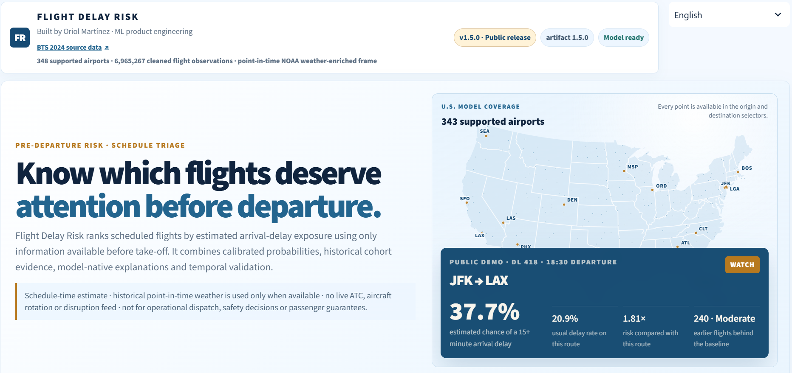
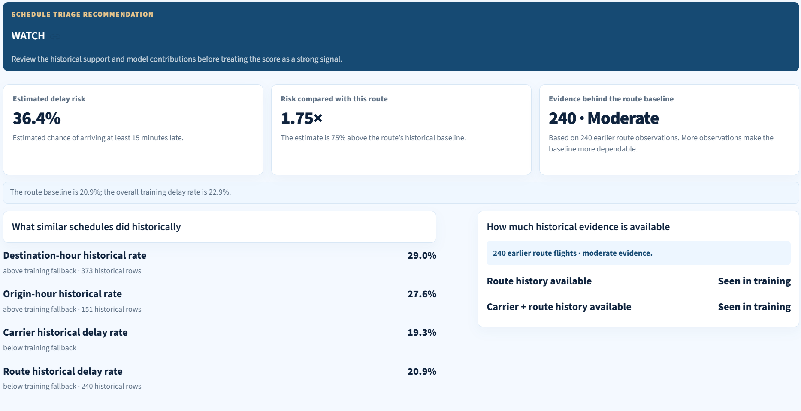
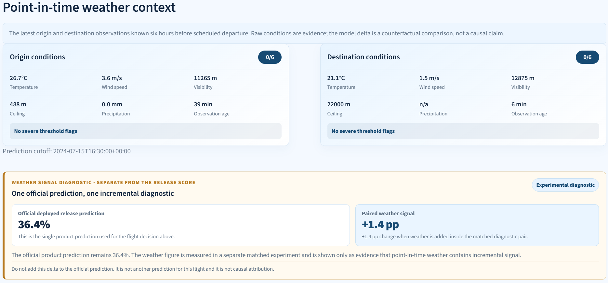
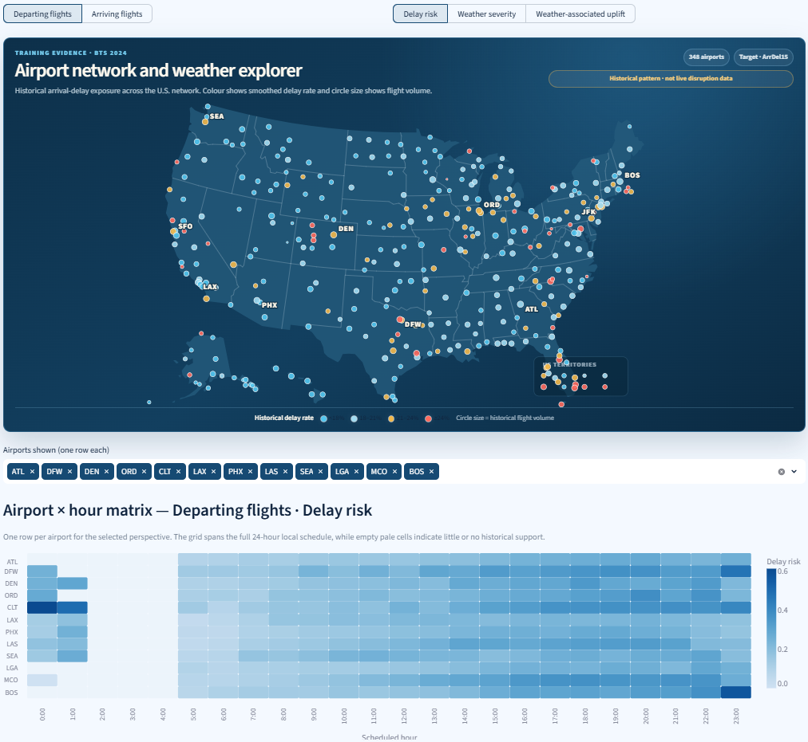
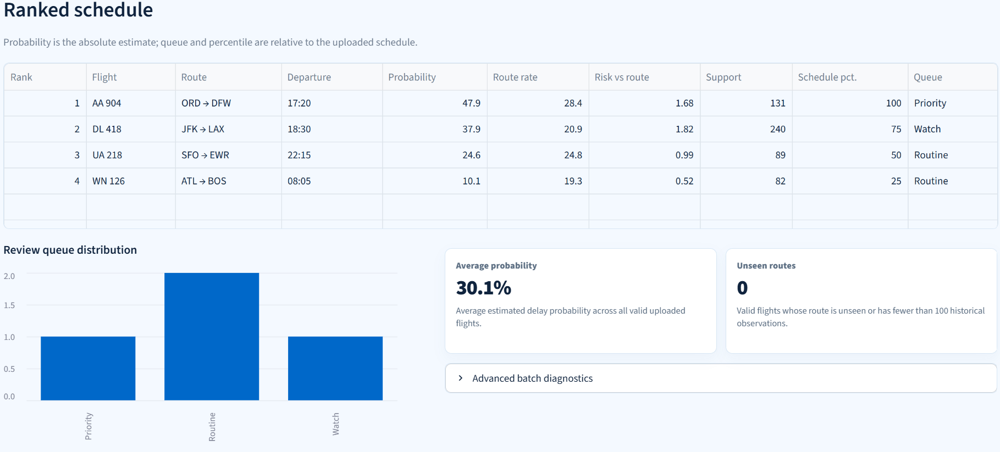
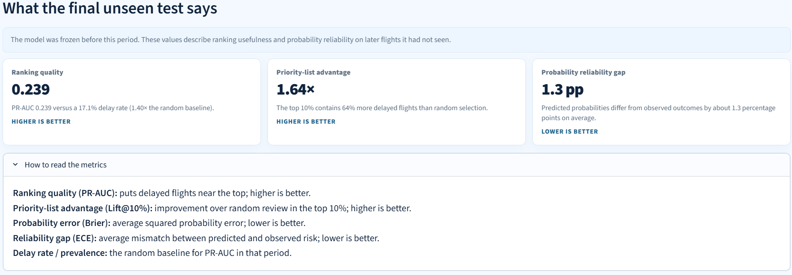
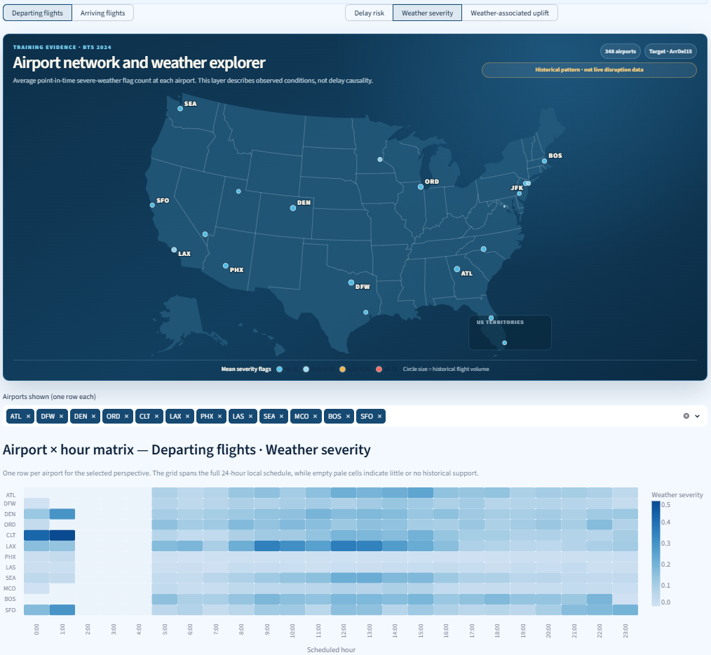
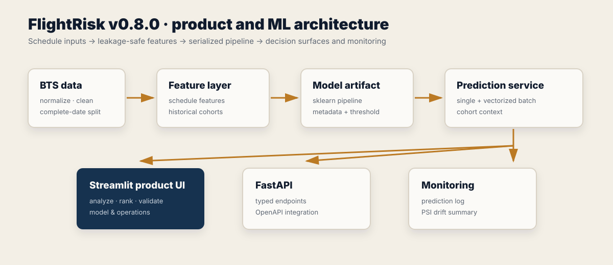
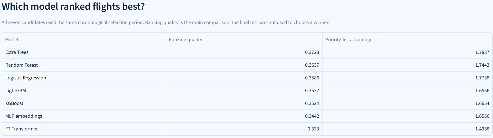

<div align="center">

[BTS flight data](https://www.transtats.bts.gov/DL_SelectFields.aspx?gnoyr_VQ=FGJ) · [NOAA/NCEI Global Hourly weather](https://www.ncei.noaa.gov/products/land-based-station/integrated-surface-database) · **7,079,081 source flights** · **6,965,267 cleaned flights** · **348 model-supported airports** · **20 NOAA-mapped airports**

# Flight Delay Risk

### Pre-departure flight-delay risk workbench

**Pre-departure decision support for limited airline operations capacity.**

Find the scheduled flights that deserve attention first, understand why they were ranked, and inspect the evidence behind the release.

[English](README.md) · [Español](README_ES.md) · [Data guide](docs/DATA.md) · [Model card](docs/MODEL_CARD.md) · [API contract](docs/openapi.json)



`Python` · `scikit-learn` · `PyTorch` · `FastAPI` · `Streamlit` · `Docker`

</div>

## Start here

An airline operations team cannot investigate every departure with the same level of attention. Flight Delay Risk turns a published schedule into a **capacity-aware review queue before take-off**:

```text
scheduled flight → clean pre-departure features → calibrated delay risk → historical evidence → review queue
```

The product answers one practical question:

> **Which scheduled flights should an analyst review first when capacity is limited?**

| Product contract | What it means |
|---|---|
| **User** | Airline operations, network-control or disruption-management analyst. |
| **Target** | Probability of arriving at least 15 minutes late (`ArrDel15`). |
| **Inputs** | Carrier, route, date, scheduled times, duration and distance. |
| **Action** | Prioritize the highest-risk 10% of an uploaded schedule. |
| **Evidence** | Route baseline, historical support, local model contributions, temporal validation and an optional 2024 historical weather replay. |
| **Boundary** | Future flights are scored with schedule-time information. Weather is a versioned 2024 historical replay only; future weather updates require a live forecast feed. |

### What the system does

- scores **published scheduled flights** using only data that should exist **before departure**;
- exposes the **historical support** behind the baseline so weak-evidence routes are visible;
- supports both **single-flight analysis** and **schedule ranking**;
- scores historical or future scheduled flights with the deployed schedule-only artifact;
- for supported 2024 dates, reconstructs **historical point-in-time weather evidence** and exposes a separate paired diagnostic for incremental signal;
- publishes the release evidence: preprocessing assumptions, temporal validation, calibration and monitoring.

### What the system does *not* do

- it does **not** ingest a live weather forecast, ATC, turnaround, maintenance, tail assignment, crew or passenger-flow data;
- it does **not** know post-departure facts such as actual departure delay, taxi-out or wheels-off times;
- it does **not** provide causal statements about weather; the uplift view is descriptive association only;
- it is **not** an operational dispatch, safety, passenger-guarantee or revenue-management system.

This is a **triage workbench**, not a promise that a flight will be delayed.

### Two product modes

| Request | What the release returns |
|---|---|
| **Historical or future scheduled flight** | The official schedule-based delay-risk score. |
| **Supported 2024 historical flight** | The same official score plus an optional NOAA point-in-time replay and paired weather diagnostic. |
| **Future flight weather update** | Not available in this release. A live, versioned forecast issued before the cutoff is required. |

The historical weather module validates whether near-departure meteorology adds signal. It is not yet an operational forecast pipeline for future flights.

## Operational result

**Honest result:** the deployed Extra Trees artifact was refitted on **168,519 flights**, calibrated with **31,028 later flights**, and evaluated once on an untouched **50,453-flight** test period from October 19 to December 31, 2024.

| Final-test signal | Result | Operational reading |
|---|---:|---|
| **Lift at top 10%** | **1.64×** | The review queue contains about 64% more delayed flights than random selection. |
| **Precision at top 10%** | **28.0%** | About 28 of every 100 prioritized flights were delayed. |
| **PR-AUC** | **0.239** | Better ranking than the **17.1%** test prevalence and the **0.203** logistic baseline. |
| **ROC-AUC** | **0.618** | Moderate discrimination from schedule-only data. |
| **Calibration error (ECE)** | **0.013** | Predicted probabilities tracked observed frequencies closely on the final test. |

The result is useful for **ranking limited attention**, not for making confident statements about individual flights. Temporal performance varies, and the committed drift audit currently reports high drift. That limitation is part of the product evidence, not hidden from it.

## Product tour

### 1. See the decision before the machinery

The landing view states the operational question, scope and current release status first. A real example shows the difference between an absolute probability, the normal rate for that route and the available historical support.

### 2. Analyze one flight

Enter natural schedule fields. Calendar and model features are derived automatically. The result returns:

- a calibrated probability of a 15+ minute arrival delay;
- `Priority`, `Watch` or `Routine` status;
- risk relative to the historical route baseline;
- the number of prior flights supporting that reference;
- factors that raised and reduced the estimate;
- for supported 2024 flights, origin and destination observations reconstructed at the declared cutoff;
- one official deployed schedule prediction plus a separate historical-replay weather diagnostic when both frozen companion artifacts are available;
- a bilingual PDF brief.



The official deployed score remains the only product prediction and can score future scheduled flights. The weather panel is available only as a historical replay for supported 2024 dates. Its paired delta must not be added to, subtracted from or treated as a replacement for the official score.



### 3. Explore airport history without leaving the flow

Scroll below the single-flight form to explore the training evidence by origin or destination. Point color represents the historical delayed-flight share; point size represents support. Hovering an airport reveals its code, rate and number of historical flights.



The map now exposes three explicit layers:

- **Delay risk:** smoothed historical `ArrDel15` rate.
- **Weather severity:** average count of severe point-in-time weather flags.
- **Weather-associated uplift:** observed adverse-weather delay rate minus clear-weather delay rate.

A second airport × hour heatmap shows how the selected layer changes through the scheduled day. The uplift layer is descriptive association, **not causal attribution**, and none of these views is a live weather forecast.

### 4. Rank an entire schedule

Upload the included CSV template or a valid schedule. Valid rows are preserved even when other rows fail. The workbench flags low-support routes, ranks calibrated risk, applies the declared 10% review budget, and exports CSV and bilingual PDF reports.



### 5. Inspect validation and operations

The final two views expose chronological folds, calibration, baseline comparisons, model lineage, API endpoints, release health and deployment evidence. The technical story remains available without blocking the main decision flow.




## Weather upgrade

Weather is treated as a leakage-sensitive **historical replay**, not as a live future-flight feed. Historical observations come from the official [NOAA/NCEI Global Hourly Integrated Surface Database](https://www.ncei.noaa.gov/products/land-based-station/integrated-surface-database); the project downloads the required 2024 station files from NOAA's [yearly HTTPS archive](https://www.ncei.noaa.gov/pub/data/noaa/2024/).

For every eligible **2024 replay flight**, the pipeline converts the scheduled origin departure to UTC, subtracts the declared six-hour prediction horizon and joins the latest observation known at that cutoff for both origin and destination. Future observations are forbidden; observations older than six hours are marked unavailable. The current mapping covers **20 airports**, while the schedule-only model continues to support **348 airports** and can score dates outside the replay window.

The UI uses weather in three ways:

1. **Historical single-flight replay:** origin and destination temperature, wind, visibility, ceiling, precipitation, observation age and severe-condition flags for a supported 2024 date.
2. **Paired weather-signal diagnostic:** two frozen companion artifacts are evaluated on the same flight, but the UI exposes only their probability difference in percentage points. The hidden companion probabilities exist to isolate the incremental weather signal; they are not alternative product predictions and the delta must not be added to the deployed release score.
3. **Network exploration:** airport map layers and an airport × hour matrix for delay rate, observed weather severity and weather-associated uplift.

The single-flight weather panel shown earlier reconstructs the latest eligible observations known at the declared cutoff for a historical 2024 flight. For a future date, the product returns the schedule-based score and explicitly reports that a live, versioned forecast feed is required; it does not reuse historical NOAA observations as a substitute.



The screenshot above must be read as **historical point-in-time evidence**, not as a live forecast. Each row represents one airport for the selected origin or destination perspective; columns represent scheduled local hours; pale empty cells indicate insufficient historical support. The uplift layer is adverse-minus-clear association and is not causal attribution.

The weather model remains a separate artifact so the public schedule-only release still works for future dates and whenever NOAA replay observations or a companion artifact are absent. The UI degrades transparently: future requests remain schedule-only with `weather_delta: null`; supported historical requests show observations when available and label the paired diagnostic unavailable if either companion model is missing. The official deployed risk is never replaced by the companion pair.

### Paired temporal evidence

The final paired experiment uses a **1,406,680-flight complete-weather cohort** extracted from the canonical cleaned 2024 frame. Base and weather models use identical rows, expanding chronological folds, frozen Extra Trees hyperparameters and the same random seed. No model-family selection occurs inside the folds.

| Three-fold paired result | Base | Base + weather | Mean delta | Weather wins |
|---|---:|---:|---:|---:|
| ROC-AUC | 0.6553 | 0.6597 | **+0.0044** | **3 / 3** |
| PR-AUC | 0.3238 | 0.3287 | **+0.0049** | **3 / 3** |
| Lift@10% | 1.773× | 1.820× | **+0.047×** | **3 / 3** |
| Brier score | 0.22107 | 0.21955 | **−0.00152** | **2 / 3** |

The conclusion is deliberately narrow: leakage-safe point-in-time weather adds a **modest but reproducible incremental ranking signal**. It improves ROC-AUC, PR-AUC and Lift@10% in all three future folds, but it does not turn the task into a deterministic flight-delay forecast.

### Frozen weather-release holdout

The two persistent companion artifacts used by the UI were trained on the same complete-weather protocol and evaluated on a later **286,367-flight** holdout. This is separate from the deployed public-release score and exists only to operationalize the paired diagnostic.

| Holdout metric | Schedule-only companion | Companion + weather | Delta |
|---|---:|---:|---:|
| ROC-AUC | 0.6235 | 0.6312 | **+0.0077** |
| PR-AUC | 0.2509 | 0.2627 | **+0.0118** |
| Lift@10% | 1.698× | 1.761× | **+0.063×** |
| Brier score | 0.14253 | 0.14179 | **−0.00073** |

The dashboard therefore shows one official deployed prediction and one **separate incremental weather signal**. It does not expose the companion probabilities as competing answers.

### Why the weather evaluation is fair

The comparison is **paired by design**. The schedule-only and weather models are trained on the **same complete-weather rows**, with the **same chronological splits**, the **same Extra Trees hyperparameters** and the **same random seed**. This isolates the incremental information content of weather instead of starting a second model-selection tournament.

[Inspect the full paired weather report](reports/paired_weather_backtest_extra_trees.md)

Build the compact UI analytics artifact:

```powershell
python -m scripts.build_weather_ui_summary `
  --data data/processed/flights_with_weather_2024.parquet `
  --output reports/weather_ui_summary.json
```

Train the separate frozen Extra Trees weather artifact:

```powershell
python -m scripts.train_weather_release `
  --data data/processed/flights_with_weather_2024.parquet
```

That command writes two paired artifacts trained on identical rows and time blocks:

```text
models/flightrisk_model_weather_base.joblib
models/flightrisk_model_weather.joblib
```

[Detailed weather UI architecture](docs/WEATHER_UI.md)

For a fast integration smoke test, add `--max-rows 300000` to either command. Smoke artifacts must not be reported as final release evidence.

## Product workflow

The model score and the business decision are intentionally separate:

```text
1. Estimate    How likely is a 15+ minute arrival delay?
2. Context     How unusual is that risk for this route?
3. Support     How much permitted historical evidence exists?
4. Constrain   How many flights can the team realistically review?
5. Prioritize  Which flights enter the review queue?
6. Monitor     Is calibration or feature drift deteriorating?
```

This separation lets the same calibrated model support a different capacity or cost policy without pretending that the classifier knows the operational decision.

## How the system works



```text
BTS monthly records
→ validation, cleaning and source fingerprinting
→ chronological train / selection / calibration / test blocks
→ schedule, historical, recency and congestion features
→ model-family comparison and scaled refit
→ sigmoid calibration
→ top-k review policy
→ FastAPI / Streamlit / PDF delivery
→ health checks, logging and drift monitoring
```

## Data and release lineage

The source and the deployed training sample are related, but they are not the same number.

| Layer | Rows | Role |
|---|---:|---|
| **BTS source** | **7,079,081** | Twelve monthly 2024 Reporting Carrier On-Time Performance files. |
| **Canonical cleaned dataset** | **6,965,267** | Valid supervised records covering all 366 days of 2024. |
| **Public release sample** | **250,000** | Deterministic release build using the frozen chronological protocol. |
| **Deployed refit** | **168,519** | Model training plus the selection block inherited into the final refit. |
| **Calibration** | **31,028** | Later holdout used to choose sigmoid calibration, then refit. |
| **Final test** | **50,453** | Untouched October–December evaluation window. |

The target is `ArrDel15 = 1` when arrival is at least 15 minutes late. Raw flight CSVs, raw NOAA station files and large processed parquets are intentionally excluded from Git; the committed manifests and mapping files record lineage, schema and coverage without pretending the raw data are bundled with the repository.

### Weather source and coverage

| Weather layer | Coverage | Role |
|---|---:|---|
| **NOAA-mapped airports** | **20** | Airports linked to an official Global Hourly station and timezone. |
| **Complete-weather paired cohort** | **1,406,680 flights** | Flights with valid point-in-time observations at both endpoints used for the frozen paired backtest. |
| **Prediction horizon** | **6 hours** | Weather must have been observable at or before this pre-departure cutoff. |
| **Maximum observation age** | **6 hours** | Older observations are marked unavailable rather than silently forward-filled. |

- [Download BTS flight records](https://www.transtats.bts.gov/DL_SelectFields.aspx?gnoyr_VQ=FGJ)
- [Open the NOAA/NCEI Global Hourly dataset](https://www.ncei.noaa.gov/products/land-based-station/integrated-surface-database)
- [Browse the NOAA 2024 HTTPS archive used by the downloader](https://www.ncei.noaa.gov/pub/data/noaa/2024/)
- [Read the data contract](docs/DATA.md)
- [Inspect the processed-data manifest](data/processed/data_manifest.json)
- [Inspect the airport-to-station mapping](data/weather/airport_station_map.csv)

## Model comparison

The model zoo compares recognizable paradigms under the same chronological selection protocol.

| Paradigm | Candidates |
|---|---|
| Interpretable baseline | Logistic Regression |
| Bagging | Random Forest, Extra Trees |
| Gradient boosting | XGBoost, LightGBM |
| Neural tabular | MLP with embeddings, FT-Transformer |

Extra Trees won the declared selection rule and was frozen before the scaled refit. Across three later temporal folds, MLP, FT-Transformer and Extra Trees each won once; no family dominated every period.



The screenshot reports the chronological **selection block** used to choose a winner. It is deliberately kept separate from the untouched final-test results reported near the top of this README.

<details>
<summary><strong>Selection benchmark</strong></summary>

| Candidate | PR-AUC | Lift@10% |
|---|---:|---:|
| **Extra Trees** | **0.3728** | **1.784×** |
| Random Forest | 0.3637 | 1.744× |
| Logistic Regression | 0.3586 | 1.774× |
| LightGBM | 0.3577 | 1.656× |
| XGBoost | 0.3524 | 1.665× |
| MLP with embeddings | 0.3442 | 1.656× |
| FT-Transformer | 0.3330 | 1.439× |

These are **selection-block** metrics, not final-test claims. The later final test is the result reported near the top of this README.

</details>

## Clean preprocessing contract

Every training run, weather ablation and temporal backtest now passes through the **same canonical preprocessing contract** before feature engineering. This is intentional: the model should not change just because one script cleaned the data differently from another.

The clean preprocessing pipeline is:

1. **Normalize BTS aliases** such as `OP_UNIQUE_CARRIER`, `CRS_ARR_TIME`, `ARR_DEL15`, `CANCELLED` and `DIVERTED` into one internal schema.
2. **Filter the supervised population** to completed, non-diverted flights with a known binary `ArrDel15` target.
3. **Reject malformed records**: invalid dates, impossible schedule fields, missing or non-binary targets, and rows that fail calendar consistency checks against `FlightDate`.
4. **Protect the inference boundary** by dropping post-departure or post-outcome columns while preserving allowed pre-departure weather features.
5. **Sort the modelling frame chronologically** so every later split, historical aggregate and backtest respects time.
6. **Log every removal reason** so the cleaned frame is auditable rather than implicit.

The result is a single modelling population: **6,965,267** cleaned 2024 flights. When you run the final holdout, the weather ablation or the expanding-window backtest, you are testing different modelling choices on the **same cleaned population**, not on quietly different data paths.

## Validation design

The release enforces **forward-only evaluation** and separates each decision in time:

```text
model training            2024-01-01 → 2024-07-16
selection / final refit   2024-07-17 → 2024-09-04
calibration               2024-09-05 → 2024-10-18
untouched final test      2024-10-19 → 2024-12-31
```

### Why this matters

1. **Candidate search happens once.** The model zoo is compared on a declared chronological selection block. Extra Trees wins there and becomes the frozen release family.
2. **Hyperparameters are frozen before later evidence.** The scaled refit uses the declared winner rather than re-optimizing on the final test.
3. **Calibration is evaluated later again.** Calibration candidates are compared on a later holdout; **sigmoid** wins and is refitted only on the permitted calibration block.
4. **The final test stays untouched.** October 19 to December 31 is reported once, after the modelling choices are already fixed.
5. **Cross-validation is temporal, not random.** The expanding-window backtests move forward through time so each fold simulates future deployment rather than mixing months randomly.

### Release evidence included

- three temporal backtest folds for the main release protocol;
- paired weather backtests on identical rows and frozen Extra Trees settings;
- confidence intervals from 100 weekly block-bootstrap samples;
- robustness checks, ablations and feature-stability evidence.

## Leakage contract

Only information available before departure may influence a prediction.

- Target-derived historical features use **strictly earlier `FlightDate` values**.
- Labels from one flight never construct another flight's features on the same day.
- Validation, calibration and test rows use maps fitted only on permitted prior periods.
- Unseen carriers, airports and routes receive explicit smoothed fallbacks.
- Actual delays, actual departure/arrival times, taxi and wheels times, cancellations, diversions and delay-cause columns are blocked.

The local explanation is a rescaled tree-path probability decomposition expressed in log-odds. It explains model behaviour, not causal mechanisms.

## Product and API surfaces

| Surface | Purpose |
|---|---|
| **Streamlit** | Bilingual single-flight analysis, schedule ranking, heatmap, validation and release evidence. |
| **FastAPI** | Typed prediction, batch ranking, reports, metadata, health and monitoring contracts. |
| **PDF / CSV** | Portable decision briefs and ranked schedules in English and Spanish. |
| **Operations** | `/live`, `/ready`, request IDs, latency headers, prediction logging and PSI monitoring. |

<details>
<summary><strong>Public endpoints</strong></summary>

```text
GET  /live
GET  /ready
GET  /model/info
GET  /model/card
POST /predict
POST /predict/batch
POST /rank
POST /reports/flight
POST /reports/schedule
GET  /monitoring/summary
GET  /monitoring/drift
```

The exported OpenAPI contract is committed at [`docs/openapi.json`](docs/openapi.json).

</details>

## Run locally

The trained artifact is included; using the product does not require retraining.

```bash
python -m venv .venv
source .venv/bin/activate      # Windows: .venv\Scripts\activate
pip install -r requirements.txt
```

Start the API:

```bash
python -m uvicorn app.api.main:app --host 0.0.0.0 --port 8000
```

Start the dashboard in another terminal:

```bash
python -m streamlit run app/dashboard/streamlit_app.py
```

Open `http://localhost:8501` for the dashboard and `http://localhost:8000/docs` for the API contract. Or run both services with:

```bash
docker compose up --build
```

## Engineering evidence

The current suite contains **128 passing tests**. The committed v1.5 release-evidence snapshot records the original **108 / 108** release gate behind the frozen artifact.

<details>
<summary><strong>Evaluation, robustness and release reports</strong></summary>

- [`reports/metrics.json`](reports/metrics.json)
- [`reports/candidate_benchmark.md`](reports/candidate_benchmark.md)
- [`reports/temporal_backtest.md`](reports/temporal_backtest.md)
- [`reports/calibration_report.md`](reports/calibration_report.md)
- [`reports/feature_ablation.md`](reports/feature_ablation.md)
- [`reports/feature_stability.md`](reports/feature_stability.md)
- [`reports/operational_policy.md`](reports/operational_policy.md)
- [`reports/robustness_audit.md`](reports/robustness_audit.md)
- [`reports/drift_analysis.md`](reports/drift_analysis.md)
- [`reports/production_smoke.json`](reports/production_smoke.json)
- [`RELEASE_MANIFEST.json`](RELEASE_MANIFEST.json)

</details>

## Repository map

```text
app/api/           FastAPI transport and public contracts
app/dashboard/     bilingual Streamlit decision interface
app/services/      prediction and reporting services
src/data/          ingestion, cleaning, manifests and temporal splitting
src/features/      schedule, historical, recency and congestion features
src/models/        training, calibration, policy and explanations
src/monitoring/    logs, robustness and drift checks
scripts/           reproducible training, evaluation and release workflows
reports/           committed evidence behind the public artifact
docs/              model card, data guide, deployment and limitations
```

## Limitations

- Future flights are scored schedule-only. The weather layer uses historical NOAA observations only inside the versioned 2024 replay window; there is no live forecast, aircraft rotation, crew, ATC or active airport disruption feed.
- Ranking quality varies through time; no model family dominated every temporal fold.
- Historical route evidence may be weak for rare or unseen combinations.
- The current drift audit is high, so retraining and threshold review would be required before operational reuse.
- Local contributions describe model behaviour, not why delays occur.
- The repository is deployment-ready, but no hosted URL is claimed until uptime is verified.

## What this project demonstrates

- end-to-end applied ML engineering on real public records;
- separation of prediction, evidence, policy and action;
- temporal validation and leakage prevention;
- classical, boosting and neural tabular model comparison;
- probability calibration, explanations, uncertainty and drift analysis;
- operational ranking under a capacity constraint;
- API, bilingual dashboard, PDF reporting, Docker, CI and release evidence;
- honest communication of moderate performance and model limitations.

## License

MIT. Built by **Oriol Martínez**.
