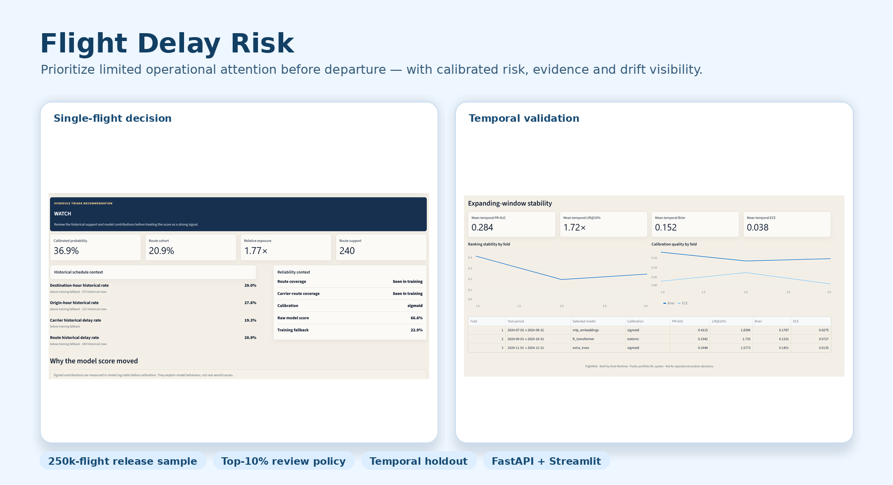

<div align="center">

# Flight Delay Risk

### Apoyo a decisiones antes de la salida para operaciones aéreas con capacidad limitada

**Prioriza qué vuelos merecen atención primero mediante riesgo calibrado, evidencia histórica y validación temporal.**

[English](README.md) · [Español](README_ES.md) · [Dataset](https://www.transtats.bts.gov/DL_SelectFields.aspx?gnoyr_VQ=FGJ) · [Contrato API](docs/openapi.json)



`Python` · `scikit-learn` · `PyTorch` · `XGBoost` · `LightGBM` · `FastAPI` · `Streamlit` · `Docker`

</div>

## El problema de negocio

Un equipo de operaciones aéreas no puede investigar todas las salidas programadas con el mismo nivel de atención. La capacidad de revisión es limitada y el riesgo cambia según ruta, aerolínea, aeropuerto, franja horaria y periodo operativo.

Flight Delay Risk está diseñado para responder una pregunta concreta:

> **¿Qué vuelos programados debería revisar primero un analista de operaciones antes de la salida?**

El sistema no convierte automáticamente una probabilidad en una decisión. Separa:

```text
datos programados del vuelo
→ riesgo calibrado de retraso
→ política de capacidad de revisión
→ cola Prioridad / Vigilancia / Rutina
```

La política actual prioriza el **10% de mayor riesgo dentro del horario cargado**. Es una herramienta de triaje, no una afirmación automática de que el vuelo se retrasará.

| Pregunta de producto | Respuesta de Flight Delay Risk |
|---|---|
| **¿Para quién está diseñado?** | Analistas de operaciones, control de red o gestión de disrupciones. |
| **¿Qué decisión apoya?** | Qué vuelos merecen primero una capacidad limitada de revisión antes de la salida. |
| **¿Qué predice?** | Probabilidad de llegar con al menos 15 minutos de retraso. |
| **¿Qué ocurre si la evidencia es débil?** | La interfaz muestra rutas desconocidas o con poco soporte histórico. |
| **¿Qué no utiliza?** | Meteorología en vivo, rotación de aeronaves, tripulación, ATC ni datos posteriores a la salida. |

## Resultado operativo

El artefacto Extra Trees desplegado se reajustó con **168.519 vuelos**, se calibró con **31.028 vuelos posteriores** y se evaluó en un test temporal intacto de **50.453 vuelos** entre octubre y diciembre de 2024.

| Resultado | Valor | Interpretación |
|---|---:|---|
| **Ventaja de la lista prioritaria** | **1,64×** | El 10% priorizado contiene alrededor de un 64% más de vuelos retrasados que una selección aleatoria. |
| **Precisión de prioridad** | **28,0%** | Aproximadamente 28 de cada 100 vuelos priorizados sufrieron retraso. |
| **Calidad del ranking (PR-AUC)** | **0,239** | El modelo ordena los vuelos retrasados por encima de los no retrasados mejor que la prevalencia base del test. |
| **Error de calibración (ECE)** | **0,013** | Las probabilidades predichas se aproximan bien a las frecuencias observadas en el test final. |

Son resultados moderados y honestos para un problema basado únicamente en información programada. El proyecto conserva resultados negativos, variación temporal y drift en lugar de presentar el mejor resultado de validación como rendimiento futuro garantizado.

## Flujo de producto

### 1. Analizar un vuelo programado

Introduce aerolínea, ruta, fecha, horarios programados, duración y distancia. La aplicación devuelve:

- probabilidad calibrada de llegar con 15 o más minutos de retraso;
- riesgo comparado con la referencia histórica de la ruta;
- número de vuelos previos que sustentan esa referencia;
- factores que elevaron o redujeron la estimación;
- informe PDF bilingüe.


### 2. Priorizar un horario con capacidad limitada

Sube la plantilla CSV incluida o un horario válido. El sistema:

1. valida cada fila;
2. conserva las filas correctas aunque otras fallen;
3. marca rutas desconocidas o con poco soporte;
4. ordena los vuelos por riesgo calibrado;
5. asigna colas `Prioridad`, `Vigilancia` y `Rutina`;
6. exporta CSV e informes PDF bilingües.

Las colas son relativas al horario cargado. La probabilidad calibrada sigue siendo la estimación absoluta del modelo.

### 3. Inspeccionar la evidencia temporal

El panel explica cómo cambiaron la familia ganadora, la calidad del ranking y la calibración en ventanas futuras. Ninguna familia dominó todos los folds.


### 4. Comprobar la salud del despliegue

El repositorio incluye:

- endpoints `/live` y `/ready`;
- metadata de modelo y release;
- request IDs y tiempos de procesamiento;
- contrato OpenAPI;
- logging de predicciones y monitorización ligera de drift mediante PSI;
- configuración Docker, Compose y Render;
- smoke test de producción para predicción y ranking.

## Por qué es un sistema de decisión y no otra demo de clasificación

Una puntuación alta no es automáticamente accionable. Flight Delay Risk hace explícita la capa de política:

- **Predicción:** ¿Qué probabilidad existe de llegar con 15 o más minutos de retraso?
- **Evidencia:** ¿Cuánto soporte histórico existe para la ruta y la cohorte?
- **Restricción:** Solo puede revisarse una fracción limitada de vuelos.
- **Decisión:** ¿Qué vuelos entran en la cola prioritaria?
- **Guardrail:** ¿Está empeorando la calibración o aparece drift?

Esta separación permite adaptar la capacidad o los costes operativos sin fingir que el propio modelo conoce la decisión de negocio.

## Datos

**Fuente oficial:** U.S. Department of Transportation, Bureau of Transportation Statistics — Reporting Carrier On-Time Performance.

- [Descargar registros de vuelos desde BTS TranStats](https://www.transtats.bts.gov/DL_SelectFields.aspx?gnoyr_VQ=FGJ)
- [Descripción del dataset y cobertura de campos](https://www.transtats.bts.gov/DatabaseInfo.asp?QO_VQ=EFD)
- [Estadísticas de puntualidad de BTS](https://www.transtats.bts.gov/ontime/)

El dataset canónico de 2024 contiene:

- **7.079.081** filas de origen procedentes de 12 archivos mensuales;
- **6.965.267** vuelos supervisados después de la limpieza;
- cobertura completa del 1 de enero al 31 de diciembre, con los 366 días;
- target `ArrDel15 = 1` cuando la llegada se produce con al menos 15 minutos de retraso.

Los CSV crudos y el parquet procesado se excluyen deliberadamente de Git. El manifiesto versionado registra hashes, limpieza, esquema, cobertura y fingerprint del dataset procesado.

Consulta [`docs/DATA.md`](docs/DATA.md).

## Comparación de modelos

El model zoo público compara paradigmas reconocibles bajo el mismo protocolo cronológico:

| Paradigma | Modelos |
|---|---|
| Baseline interpretable | Logistic Regression |
| Bagging | Random Forest, Extra Trees |
| Gradient boosting | XGBoost, LightGBM |
| Neural tabular | MLP con embeddings, FT-Transformer |

Extra Trees ganó la regla de selección declarada. PyTorch se utiliza para los dos candidatos neuronales; el modelo desplegado es Extra Trees de scikit-learn.

<details>
<summary><strong>Benchmark de selección</strong></summary>

| Modelo | PR-AUC | Lift@10% |
|---|---:|---:|
| **Extra Trees** | **0,3728** | **1,784×** |
| Random Forest | 0,3637 | 1,744× |
| Logistic Regression | 0,3586 | 1,774× |
| LightGBM | 0,3577 | 1,656× |
| XGBoost | 0,3524 | 1,665× |
| MLP con embeddings | 0,3442 | 1,656× |
| FT-Transformer | 0,3330 | 1,439× |

El modelo se seleccionó en un bloque cronológico de selección, no utilizando el test final.

</details>

## Diseño de validación

La release sigue un contrato cronológico estricto:

```text
entrenamiento
→ selección de modelo
→ calibración y política
→ test final intacto
```

Las features históricas derivadas del target solo utilizan fechas anteriores. Las etiquetas del mismo día nunca se utilizan para construir features de otras filas de esa fecha.

Se bloquean explícitamente campos posteriores al vuelo como retrasos reales, horas reales, taxi, cancelación, desvío y causas de retraso.

<details>
<summary><strong>Evidencia técnica e informes</strong></summary>

- [`reports/candidate_benchmark.md`](reports/candidate_benchmark.md)
- [`reports/temporal_backtest.md`](reports/temporal_backtest.md)
- [`reports/feature_ablation.md`](reports/feature_ablation.md)
- [`reports/feature_stability.md`](reports/feature_stability.md)
- [`reports/operational_policy.md`](reports/operational_policy.md)
- [`reports/robustness_audit.md`](reports/robustness_audit.md)
- [`reports/drift_analysis.md`](reports/drift_analysis.md)
- [`docs/MODEL_CARD.md`](docs/MODEL_CARD.md)
- [`docs/LIMITATIONS.md`](docs/LIMITATIONS.md)

</details>

## Arquitectura


```text
registros mensuales BTS
→ validación, limpieza y fingerprinting
→ particiones cronológicas
→ features de horario, histórico, soporte, recencia y congestión
→ comparación de familias
→ calibración
→ política top-k
→ FastAPI / Streamlit / PDF
→ logging, health checks y drift
```

## Ejecutar localmente

El modelo entrenado está incluido. No necesitas reentrenarlo para usar la aplicación.

```bash
python -m venv .venv
source .venv/bin/activate      # Windows: .venv\Scripts\activate
pip install -r requirements.txt
```

Arranca la API:

```bash
python -m uvicorn app.api.main:app --host 0.0.0.0 --port 8000
```

En otra terminal, arranca el dashboard:

```bash
python -m streamlit run app/dashboard/streamlit_app.py
```

Abre:

- Dashboard: `http://localhost:8501`
- Documentación API: `http://localhost:8000/docs`
- Readiness: `http://localhost:8000/ready`

O utiliza Docker:

```bash
docker compose up --build
```

## Estructura del repositorio

```text
app/api/           contratos públicos y transporte FastAPI
app/dashboard/     interfaz bilingüe de decisión
app/services/      predicción e informes
src/data/          ingestión, limpieza, manifiestos y splits temporales
src/features/      horario, histórico, recencia y congestión
src/models/        entrenamiento, calibración, política y explicaciones
src/monitoring/    logs, robustez y drift
scripts/           workflows reproducibles de entrenamiento y release
reports/           evidencia versionada del artefacto público
docs/              model card, guía de datos, despliegue y limitaciones
```

## Limitaciones

- Los inputs schedule-only no observan meteorología en vivo, rotación de aeronaves, tripulación, ATC ni disrupciones aeroportuarias.
- El rendimiento cambia con el tiempo; ninguna familia dominó todos los folds.
- La evidencia histórica puede ser débil para rutas raras o desconocidas.
- Las contribuciones locales explican el comportamiento del modelo, no mecanismos causales.
- El repositorio está preparado para despliegue, pero no declara una URL pública hasta verificar su disponibilidad.

## Qué demuestra este proyecto

- ML engineering aplicado end-to-end sobre registros públicos reales;
- separación entre predicción, evidencia, política y acción;
- validación temporal y prevención de leakage;
- comparación de modelos clásicos, boosting y redes tabulares;
- calibración, incertidumbre y análisis de drift;
- ranking operativo bajo una restricción de capacidad;
- API, dashboard, PDF, Docker, CI y evidencia de release;
- comunicación honesta de rendimiento moderado y limitaciones.

## Licencia

MIT. Desarrollado por **Oriol Martínez**.
